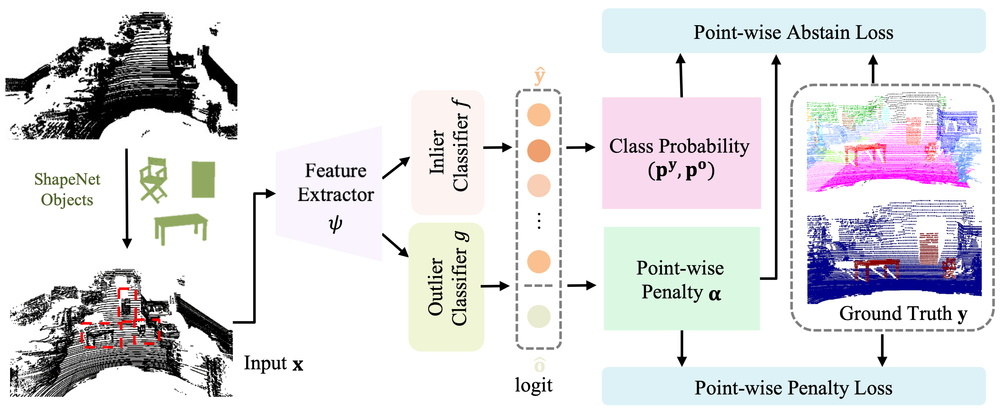
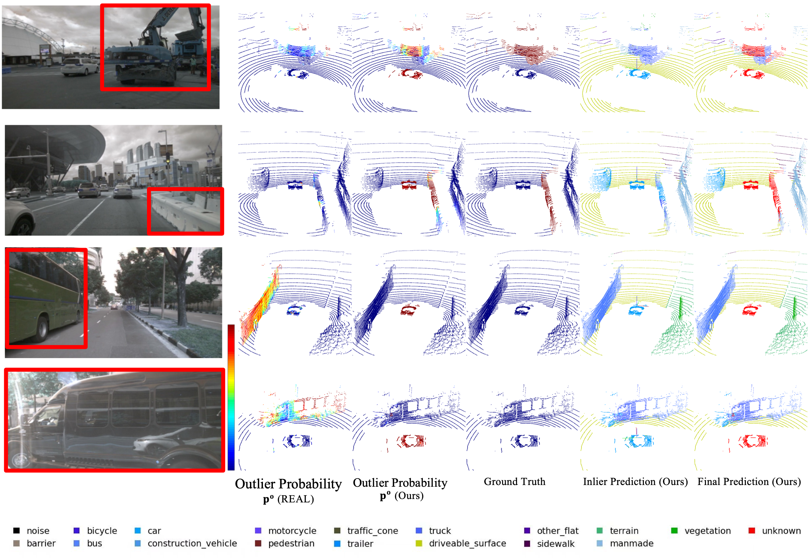

# [AAAI2025] LiON: Learning Point-wise  Abstaining Penalty for LiDAR  Outlier DetectioN Using Diverse Synthetic Data 


Official implementation of 《LiON: Learning Point-wise  Abstaining Penalty for LiDAR  Outlier DetectioN Using Diverse Synthetic Data》. After saving the corresponding inference result files using this repository, please use [semantic_kitti_api](https://github.com/Jun-CEN/semantic_kitti_api) and [nuScenes_api](https://github.com/Jun-CEN/nuScenes_api) to evaluate the performance.







## Installation

To set up the environment, please refer to the following script instructions:

```
bash install.sh

```


## Data Preparation

All of the datasets mentioned below are located in the "datasets" directory at the root of the repository.


### SemanticKITTI
```
./
├── 
├── ...
└── path_to_data_shown_in_config/
    ├──sequences
        ├── 00/           
        │   ├── velodyne/	
        |   |	├── 000000.bin
        |   |	├── 000001.bin
        |   |	└── ...
        │   └── labels/ 
        |       ├── 000000.label
        |       ├── 000001.label
        |       └── ...
        ├── 08/ # for validation
        ├── 11/ # 11-21 for testing
        └── 21/
	    └── ...
```

### nuScenes
```
./
├── ...
├── v1.0-trainval
├── v1.0-test
├── samples
├── sweeps
├── maps
└── lidarseg/
    ├──v1.0-trainval/
    ├──v1.0-mini/
    ├──v1.0-test/
    ├──nuscenes_infos_train.pkl
    ├──nuscenes_infos_val.pkl
    ├──nuscenes_infos_test.pkl
└── panoptic/
    ├──v1.0-trainval/
    ├──v1.0-mini/
    ├──v1.0-test/
```


### ShapeNet

```
./
├── ...
├── object_path_list.txt 
├── metadata.yaml
├── 02933112
├── 02958343
├── 03001627
├── 03211117
├── 03636649
├── 03691459
├── 04090263
├── 04256520
├── 04379243
├── 04401088
├── 04530566
├── 02828884
└── 02691156
    ├──
    ├──test.lst
    ├──train.lst
    ├──val.lst
    ├──d2e2e23f5be557e2d1ab3b031c100cb1
        ├── df.npy
        ├── img_choy2016
        ├── model.binvox
        ├── pointcloud.npz
        └── points.npz
    ...

```


<!-- [object_path_list.txt](https://pan.baidu.com/s/1XO0mI1tgT6K1OxLzDxu9Sg) (extract code: zkjt) -->


## Usage 
All scripts for training and evaluation is in `./scripts`.

### Model Zoo 


| Dataset       | base segmentation model                                      | outlier segmentation model                                   |
| ------------- | ------------------------------------------------------------ | ------------------------------------------------------------ |
| SemanticKITTI | [Baidu Disk](https://pan.baidu.com/s/14d9qlwqf85gzmVOxfmYm7w) (jpmn),  [Google Disk](https://drive.google.com/file/d/1TmKUnDM1qPVuIxsqKzHWd4rflnOL0P64/view?usp=drive_link) | [Baidu Disk](https://pan.baidu.com/s/1QEuGBLlevoCkkmy4d04pOQ) (pbqx), [Google Disk](https://drive.google.com/file/d/1Q3m5T5ao4eEm2Waqaoutwvf1Wk7pULYE/view?usp=drive_link) |
| NuScenes      | [Baidu Disk](https://pan.baidu.com/s/1YqepjulUMmRfFS4XyQzyNg) ( h9gh),   [Google Disk](https://drive.google.com/file/d/1-Gm0vENsfFDYuX7Jzp6vKt7uUCT71PMn/view?usp=drive_link) | [Baidu Disk](https://pan.baidu.com/s/1Xe_XjAqQbD3TiT9iakkW9w) ( 69fa), [ Google Disk](https://drive.google.com/file/d/1HqbiC7igmGhBbaz72NF4NGx328ZB4CSz/view?usp=drive_link) |


### SemanticKITTI

#### Traning 


1. Download the bese segmentation model
2.  navigate to `/config/semantickitti_ood_final.yaml` and update the path for the pretrained naive model on line 73.
3. Finally, execute the following command: 
```
bash scripts/train_kitti.sh
```


#### Evaluation 

1.  modify the resume_path variable in the `scripts/eval_kitti.sh` file to the appropriate path of the model.
2.  execute the following command: 


```
bash scripts/eval_kitti.sh
```


### NuScenes


#### Traning 


1. Download the bese nuscenes segmentation model
2.  navigate to `/config/nuScenes_ood_final.yaml` and update the path for the pretrained naive model on line 66.
3. Finally, execute the following command: 
```
bash scripts/train_nusc.sh
```


#### Evaluation 
1.  modify the resume_path variable in the `scripts/eval_nusc.sh` file to the appropriate path of the model.
2.  execute the following command: 


```
bash scripts/eval_nusc.sh
```


## Acknowledgements
Parts of this code were based on the codebase of  [REAL](https://github.com/Jun-CEN/Open_world_3D_semantic_segmentation.git).
